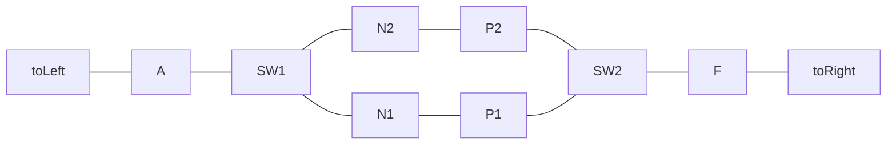
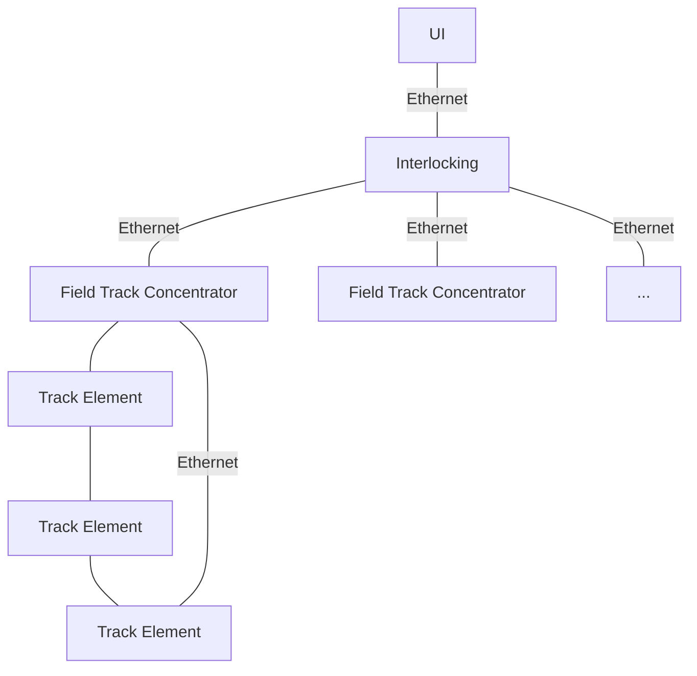
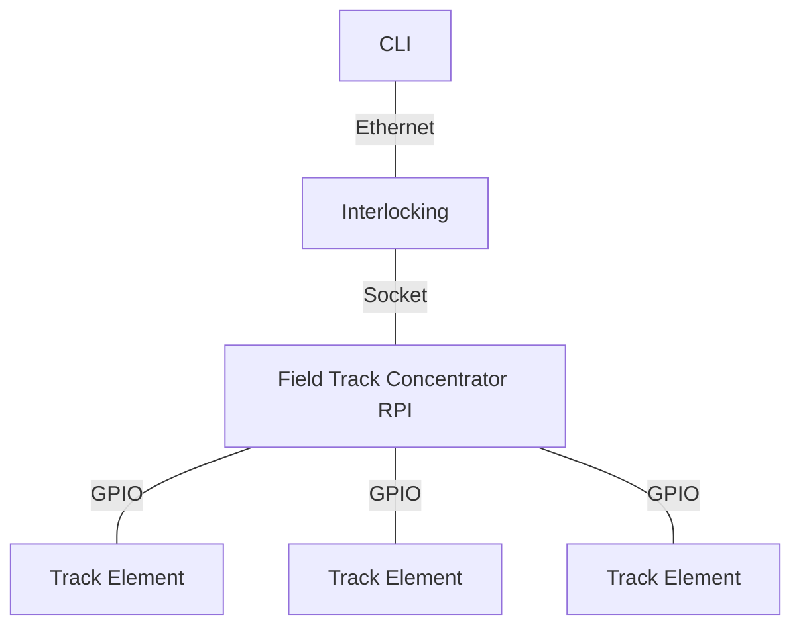

# Digital Rail

[](https://github.com/yannickkirschen/digital-rail/actions/workflows/maven-package.yml)
[](https://github.com/yannickkirschen/digital-rail/actions/workflows/python-build.yml)
[](https://github.com/yannickkirschen/digital-rail/releases/)

Digital Rail is an interlocking system for model railways. It aims to be as
realistic as possible and is based on the German railway system. It is written
in Java and Python and is designed to be used on a Raspberry Pi (Zero).

## State of Development

- 🚧Interlocking
- 🚧Track Field Concentrator
- 🚧CLI
- ⛔️UI
- ⛔️Decoders
- ⛔Documentation (I'm so sorry ...)

## Usage

### Build and run concentrator

```shell
cd digital-rail-concentrator
python -m pip install --upgrade pip wheel
python setup.py bdist_wheel build
# After transferring the .whl file to the pi:
python -m pip install digital_rail_concentrator-0.0.1-py3-none-any.whl
rail-concentrator
```

### Build and run interlocking

```shell
mvn clean package
export DOCUMENT_PATH=./examples/document.json
java -jar digital-rail-interlocking/target/digital-rail-interlocking-0.0.1-SNAPSHOT.jar
```

### Run CLI

```shell
export SOCKET_SERVER_IP=<ip or hostname>
java -jar digital-rail-cli/target/digital-rail-cli-0.0.1-SNAPSHOT-jar-with-dependencies.jar
```

## CLI Usage

Syntax is `from.to`, e.g. `A.P2`.

The provided track looks like this:



## Architecture

### Real World Architecture

The goal is to create a topology inspired
by [Digitale Schiene Deutschland (digital rail Germany)](https://digitale-schiene-deutschland.de/en).
This would result in the following architecture:



### Current Architecture

The current architecture is a bit different, as the project is under
development.
The following diagram shows the current architecture:


