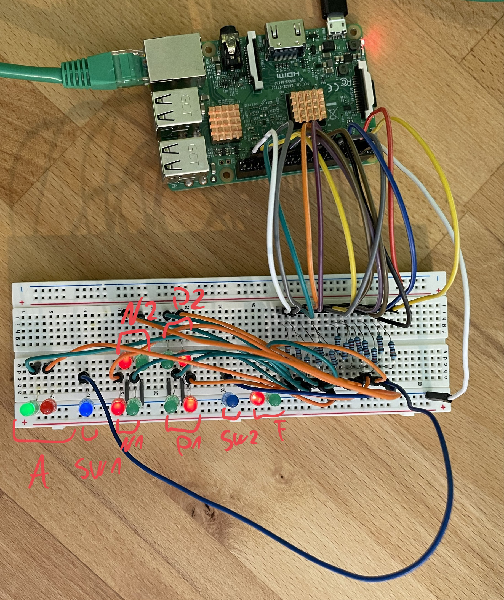

# Digital Rail

[](https://github.com/yannickkirschen/digital-rail/actions/workflows/maven-package.yml)
[](https://github.com/yannickkirschen/digital-rail/releases/)

Digital Rail is an interlocking system for model railways. It aims to be as
realistic as possible and is based on the German railway system. It is written
in Java and is designed to be used on a Raspberry Pi (Zero).

Basis of the interlocking is a graph using
an [adjacency list](https://en.wikipedia.org/wiki/Adjacency_list). By using
the [depth first search](https://en.wikipedia.org/wiki/Depth-first_search)
algorithm, the interlocking is able to determine all possible paths in the
graph. Not every path makes logically sense for a train, so we need to filter
them out. Keep in mind that if there are several paths between two nodes, the
interlocking will only use the first one it finds. This will be solved in the
future.

It uses a declarative API to define just anything. The following example shows
how a signal could look like:

```yaml
apiVersion: rail.yannick.sh/v1alpha1
kind: Signal

metadata:
    name: signal-A

    labels:
        rail.yannick.sh/displayName: A
        rail.yannick.sh/raspberry: rpi
        rail.yannick.sh/raspberry-stop-pin: 19
        rail.yannick.sh/raspberry-clear-pin: 26

spec:
    indication: stop
```

You can find all example resources in `./examples`.

## State of Development

- 🚧 Interlocking
    - ✅ Find all paths (Spurplan)
    - ✅ Determine indication/position of signals/switches on a path
    - ✅ Lock all elements on a path and transmit the indication/position of
      signals/switches to the concentrator
    - ✅ Release single elements on a path
    - ⛔ Find the best path (currently: first path)
    - ⛔️ Provide flank protection (Flankenschutz)
    - ✅ Allocate elements in specific order (switches -> flank protective
      signals -> signals -> starting signal)
    - ⛔️ Communication between interlocking systems
- 🚧 Track Field Concentrator (Gleisfeldkonzentrator, GFK)
- 🚧 CLI
- ⛔️ UI
- ⛔️ Decoders
- ⛔️ Track vacancy detection system (Gleisfreimeldeanlage)
- ⛔ Documentation (I'm so sorry ...)

## Current look and feel

Right now, I have implemented a simple track graph on a breadboard using LEDs
both for signals and switches. As I want to cover motors for the switches at a
later point, I have used a relay to simulate the motor. If the switch should
point to its alternate position, the blue LED is on. If the switch should point
to its base position, the red LED is off. The image below shows my setup:



The above state can be achieved by typing `A.P2` into the CLI. The track graph
looks like this:


## Usage

### Build

```shell
mvn clean package
```

### Run

```shell
# On the Pi
scp -r distribution user@pi:/home/user
sudo ./distribution/run.sh # in /home/user

# On your machine
java -jar digital-rail-interlocking/target/digital-rail-interlocking-1.0.0-SNAPSHOT.jar
java -jar digital-rail-cli/target/digital-rail-cli-1.0.0-SNAPSHOT-jar-with-dependencies.jar
```

## Architecture

### Real World Architecture

The goal is to create a topology inspired
by [Digitale Schiene Deutschland (digital rail Germany)](https://digitale-schiene-deutschland.de/en).
This would result in the following architecture:


### Current Architecture

The current architecture is a bit different, as the project is under
development.
The following diagram shows the current architecture:


